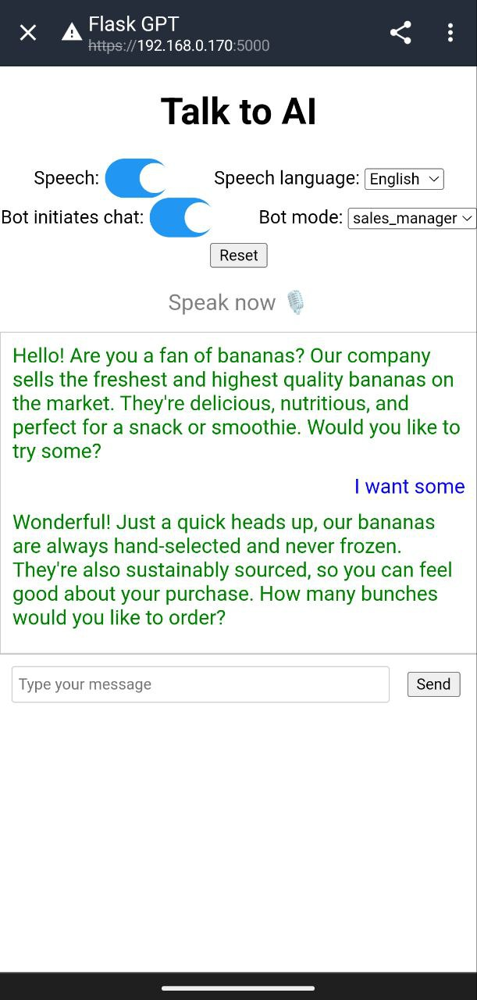

# About  
Minimalistic toolkit for prototyping GPT-based Python applications with following components:
- Flask API, which serves as a middleware between web UI and OpenAI API
- Web UI in vanilla JavaScript, which interacts with Flask API
- OpenAI API - requires API key



# Features
* Voice-enabled in-browser bot interaction using Web Speech API (Google Chrome only)
* Web chat interface
* Easily customizable GPT contexts and prompts on the Python side

# Setup
```
pip install -r requirements
export API_KEY=your_openai_api_key
python app.py
```

# Usage
1. Access the app at https://localhost:5000
2. Select bot mode   
3. Click on the `Start' button to start the chat

# Customization

* To customize chat modes, modify the `gpt_contexts` dictionary in the `config.py` file.
* To additionally transform user inputs and ChatGPT outputs, edit `preprocess_user_input` and `postprocess_ai_response` functions in `app.py`

# Notes
1. Speech recognition and synthesis works only in Google Chrome (both mobile and desktop)
2. The server uses self-signed SSL/TLS certificate, so you need to get through the browser warning. It's required for API calls and speech services to work in mobile Chrome.
3. Desktop Chrome sometimes causes the web server to freeze, probably due to Prefetch feature
4. Not suitable for production use.